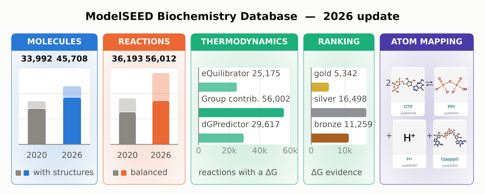
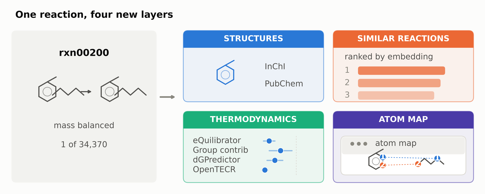
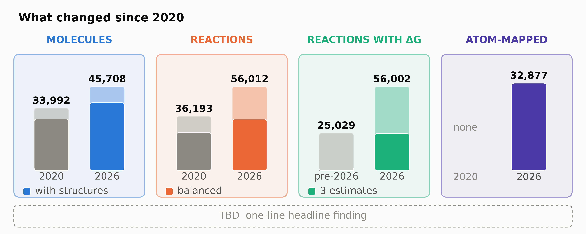
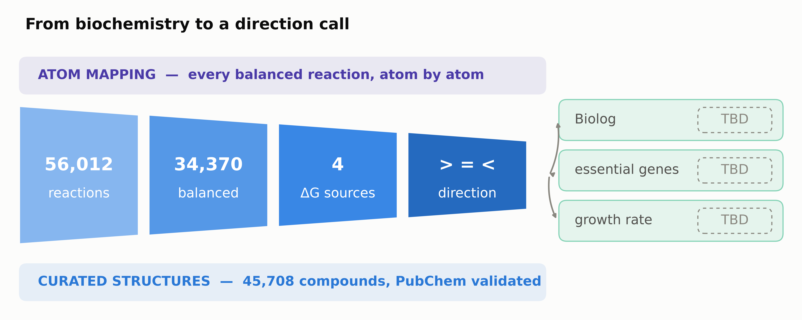
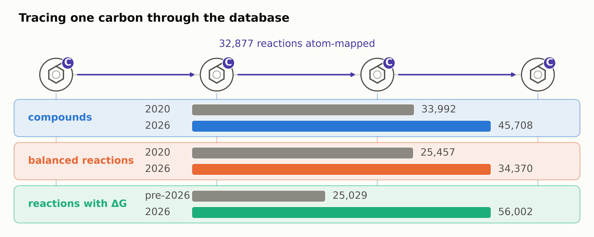
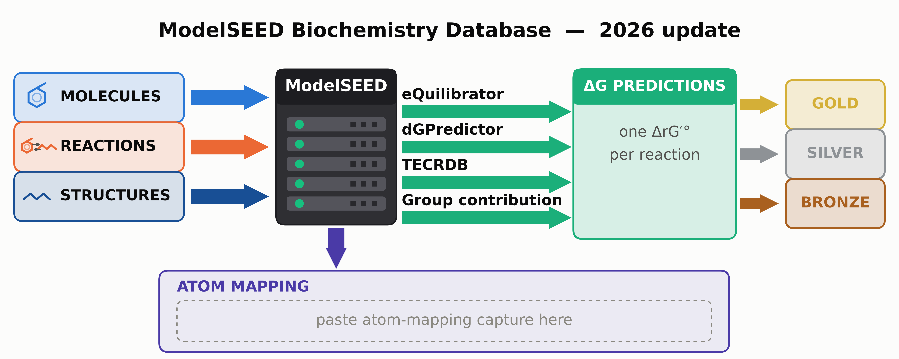

# Graphical abstract — concepts for the 2026 NAR update

Working document for choosing the mandatory NAR graphical abstract. Five
layouts are already rendered as mockups; two more are sketched in prose. Pick a
direction, then we replace the placeholders with real artwork.

Rendered mockups live in [`latex/figures/ga_*/`](latex/figures/). They are
**layout studies, not the submission file** — the molecule drawings are
hand-drawn glyphs and every unresolved number is a dashed `TBD` chip.

**All bar charts use real counts**, read from ModelSEED `dev` @ `d64fdc6f`
(2026-09-10) by [`scripts/build_msdb_counts.py`](scripts/build_msdb_counts.py)
into [`data/msdb_counts.tsv`](data/msdb_counts.tsv). The four headline counts
match Table 2 in the manuscript exactly, so the abstract and the table agree.

---

## 1. What the abstract has to carry

The manuscript ([`latex/sections/`](latex/sections/)) makes four claims plus one
empirical finding. Everything below is what a reader should take away in the
three seconds they give a graphical abstract.

### Growth in the database

Six years of community curation, driven mainly by MetaCyc and the BioCyc family;
KEGG is roughly flat.

| | 2020 | 2026 | |
|---|---:|---:|---|
| Compounds | 33,992 | **45,708** | +34% |
| Compounds with structures | 28,120 | **36,943** | 83% → 81% |
| Reactions | 36,193 | **56,012** | +55% |
| Balanced reactions | 25,457 | **34,370** | 70% → **61%** |
| Rhea reactions | 8,786 | **17,477** | doubled |

The balanced-*share* regression from 70% to 61% is the manuscript's load-bearing
hook — reaction ingestion outran balance-restoring curation. It is honest, but
it is a bad headline for a graphical abstract. **Recommendation: lead with the
absolute counts (+34% / +55%), not the share.**

### Structure curation

RDKit canonicalisation to a fixed point; a PubChem validator with a stereo-loss
guard; per-curator override files where the *rationale* field is mandatory; a
three-way formula-conflict classifier (H-only / heavy-atom / element-set) that
auto-picks the source matching `compound_*.json`; a mass-balance exclusion
registry (4 compounds) for formulas no source can reproduce; and protein-carrier
cofactor standardisation — 47 pantetheine-inclusive acyl-ACP overrides with zero
newly-imbalanced reactions, extending to biotinyl-BCCP and lipoyl carriers.

### Multi-source thermodynamics

Two sources in 2020 → four in 2026: eQuilibrator (refreshed), group contribution
(rebuilt from MFAToolkit), dGPredictor (retrained on ModelSEED), and OpenTECR
(experimental). Each reaction carries a per-source ΔrG′° with uncertainty; the
combined ledger drives a direction assignment of `>` / `<` / `=`, with
per-reaction-class heuristic overlays on top.

The manuscript marks the coverage `[TBD]`, but the stored fields already carry
it, so the bars use it:

| Estimator | Reactions with a stored ΔrG′° |
|---|---:|
| Group contribution | 56,002 |
| dGPredictor (retrained) | 29,617 |
| eQuilibrator (2026 refresh) | 25,175 |
| eQuilibrator (pre-refresh) | 25,029 |
| TECRDB, experimentally measured | 797 |

**ΔG estimates per reaction** is the sharper framing of "thermodynamic data per
reaction": of the 34,370 balanced reactions, **20,464 now carry three independent
estimates**, 2,140 carry two, and 11,766 carry one. Evidence grades across the
whole set: 5,342 gold, 16,498 silver, 11,259 bronze.

Direction, over balanced reactions only: 12,629 reversible (`=`), 9,922 forward
(`>`), 1,158 reverse (`<`), 10,661 still unassigned (`?`). Over all 56,012 the
unassigned share is 46%, which is why the strip in concept A is drawn on the
balanced population — say if you would rather it showed the whole database.

### Reaction similarity

New in 2026: every mass-balanced reaction embedded by a reaction foundation
model, cosine similarity over all pairs, full matrix regenerable in ~10 minutes
on one GPU. Used as a reconciliation diagnostic and as a feature for annotation
transfer and gap-filling.

### Atom mapping

New in 2026, via the collaboration: reactant→product atom correspondence for
mass-balanced reactions, enabling ¹³C flux analysis, degradation prediction and
cofactor-usage attribution. Exposed on atom-mapping-aware reaction pages on the
website — this is the feature with a genuine **UI** story.

Also marked `[TBD]` in the manuscript, also already in the data: **32,877
reactions are atom-mapped** — 25,058 `clean` and 7,819 `salvaged` — which is
**96% of the 34,370 balanced reactions** and 59% of the database. That is a
strong enough number to be a headline in its own right.

### The empirical finding

Four direction sources × the ModelSEED v2 draft-model corpus, scored on growth
rate, essential-gene sets, infeasible reactions, and the 390 Biolog conditions.
This is the paper's novel contribution and is **entirely `[TBD]`** — the study
has not been run. Any concept that puts it front and centre is a bet on that
result arriving in time.

### One ambiguity to settle

"Ranking of reactions" reads two ways in the manuscript, and the concepts split
on it:

- **ΔG ranking** — ordering reactions by their thermodynamic estimate and
  confidence, which is what produces the direction call. Concepts A, D, E.
- **Similarity ranking** — nearest-neighbour reactions from the embedding
  matrix. Concept B.

Both are real 2026 capabilities. Tell me which you meant and I will make it
consistent across whichever concept we take forward.

---

## 2. Constraints (from [`latex/NAR_REQUIREMENTS.md`](latex/NAR_REQUIREMENTS.md) §4)

Mandatory. 5:2 aspect, ≥127×50 mm, TIF/EPS/editable PDF, 300–600 dpi, landscape,
sans-serif (Arial) 12–16 pt. Must "be simple", "use colour", "use text sparingly,
mainly for labels", "read from top down or left to right", be **original** (not
reused from any main or supplementary figure), and carry no trademarked logos.
Submitted as a separate file, not embedded in the LaTeX.

Two consequences worth knowing before you judge the mockups:

- **The 12 pt floor is why these look sparse.** The mockups are drawn at
  254×101.6 mm and the generator refuses to emit any text below 12 pt. That is
  roughly 20 characters across a quarter-width panel. It is the binding
  constraint on all five layouts, and it is exactly the discipline NAR is asking
  for. The one open question is whether 12 pt should also survive a downscale to
  the 127 mm minimum — if a co-author wants that, it is `PT_SCALE = 2.0` in the
  script, but every panel then needs re-cutting for half the text.
- **Originality.** None of these may be reused as Figure 1. If we want a
  four-axis overview figure in the body too, it has to be a visibly different
  drawing.

---

## 3. The concepts

### A — Pipeline ribbon (the requested left-to-right flow chart)



`molecules → reactions → thermodynamics → atom mapping`, four gradient panels,
each a real chart. Covers all four requested features in the requested order and
reads left-to-right exactly as NAR asks.

Current state after the last revision round:

- **Panels 1 and 2 share one bar scale** (top = 56,012), so a taller bar means a
  bigger number *across* panels, not only within one. Self-scaled panels had
  made 45,708 compounds and 56,012 reactions look identical in magnitude.
- **Every bar is verified proportional.** Each one registers its value, scale
  top and drawn length; `_check_bar_scale()` fails the run if drawn/axis ever
  departs from value/top, and the full audit is written to `_stats.tsv` as
  `scale:*` rows. Nothing here is eyeballed.
- **Single centred title.** The old two-line left-aligned title left the
  top-right corner empty against four symmetric panels.
- **Gradient panel backgrounds**, tint 0.20 → 0.02 down each panel. Drawn as 48
  pre-blended opaque bands, not an image — an `imshow` ramp exports as an
  embedded raster and would have put a bitmap inside an otherwise all-vector
  PDF. Verified: the PDF still contains zero raster XObjects.
- **The "direction source changes model output" rail is gone**, and the panels
  grew into the space it freed.
- **Every panel is now a proper chart** — white plot area inset from the panel
  gradient, gridlines on a shared 0–60k axis, tick labels and a zero baseline.
  All four panels share one scale, so bar heights are comparable across the
  whole figure, and the four plot boxes sit at the same height.
- **The connecting arrows are gone.** Reading order now comes from position and
  the panel sequence alone.
- **The placeholder atom map is gone.** Panel 4 is real coverage data:
  34,370 balanced against 32,877 mapped, split clean (25,058) vs salvaged
  (7,819). Nothing in this figure is invented artwork any more.
- **Spacing is audited, not eyeballed.** `_check_text_overlaps()` fails the run
  if any two labels come within 1.5 px, if a label leaves the canvas, or if a
  label overflows the panel it sits in. It caught a 0.7 mm overflow of the
  TECRDB caption that was not visible at review size. Labels drawn *inside* a
  mark (atom numbers, the `> = <` glyphs) are exempt — they are separated by the
  mark, not by whitespace.

Open risks: four equal panels still read as a list rather than a pipeline, and
with the arrows gone that is more true, not less — worth deciding whether the
"flow" reading matters or whether this is now simply a four-panel summary. The
thermodynamics panel also no longer states the "20,464 balanced reactions with
three independent estimates" fact; there is no room for it at 12 pt in a 61 mm
column, and it is the detail I would most want back if we can find space.

**No placeholders left.** Every value is real; the only outstanding item is
whether to add a real screenshot of an atom-mapping reaction page, which is the
one thing lost when the placeholder molecules were removed.

### B — One reaction, four lenses



A single hero reaction on the left, and four cards showing what the 2026 database
now knows about it: structures, ranked similar reactions, four ΔG estimates, and
its atom map.

This is the strongest *scientific* pitch. It sells depth per record instead of
size of database, which is the more defensible claim given the balanced-share
regression, and it is the only concept where the four features are visibly about
the same object rather than four unrelated announcements.

It undersells growth — the counts appear only as "1 of 34,370" — and it needs a
hero reaction chosen for the purpose (small enough to draw at this size, with
real ΔG spread across the four sources, and an atom map that is actually
interesting).

**Placeholders:** the hero reaction itself; similarity scores; ΔG dots; atom map.

### C — Before / after ledger



2020 on top in grey, 2026 below in colour, four columns, arrows pointing down.

The most legible of the five and the fastest to read — for an *update* paper,
"here is what changed" is precisely the genre. Reads top-down, which NAR allows.

It is also the least visually interesting, and it reads as a table with rounded
corners. Two of the four cells ("4 sources", "in the UI") are words rather than
quantities, which weakens the symmetry the layout depends on.

**Placeholders:** the one-line headline finding across the bottom.

### D — Funnel to a direction call



56,012 reactions narrow to 34,370 balanced, to four ΔG sources, to one direction
per reaction — then fan out into growth rate, essential genes and Biolog.

This is the concept that argues the paper's actual novel contribution: the
direction call is a *choice*, and the choice propagates. Structures and atom
mapping become supporting rails rather than headline panels.

Two problems. The whole right-hand third is `TBD` until the sensitivity study
runs, so this concept cannot be finished early. And it demotes atom mapping —
one of the four features you asked to foreground — to a strip of text.

**Placeholders:** all three impact chips.

### E — Atom-trace spine



One carbon followed through four reactions across the top; the data layers that
make the trace possible stacked underneath.

The most distinctive of the five and the only one that shows *why* atom mapping
matters rather than just announcing it. The layered base makes the dependency
argument cleanly: you cannot trace an atom without curated structures, balance,
and a direction.

It is also the most abstract, and the layer bands are currently text — they need
real miniature visuals to earn their space. Thermodynamics gets one line.

**Placeholders:** the pathway and the traced atom; all three layer bands.

### F — Server hub *(drawn from the hand sketch, [`assets/sketch_server_hub_IMG_6387.jpeg`](assets/sketch_server_hub_IMG_6387.jpeg))*



The database as a physical hub. Molecules, reactions and structures arrive from
the left; atom mapping drops out of the bottom; the four ΔrG′° estimators fan
out to the right, merge into one prediction, and that prediction is graded gold
/ silver / bronze.

Closest of all the candidates to how the update is actually organised, and the
only one that shows the grading as a *consequence* of having four independent
estimators rather than as a fourth unrelated topic. The rack is a literal
picture of "the database", which makes the inbound/outbound reading immediate
without a legend.

Costs: it carries **no data at all**. Counts were stripped on request, so this
is a structure diagram — it says what the update contains and how the pieces
connect, but nothing about how much of anything there is, and nothing about
2020. Concepts A and C carry the growth story; this one does not. The rack is
also a metaphor occupying roughly an eighth of the canvas.

If numbers are wanted back, they were previously drawn beside each input chip,
each source arrow and each grade chip, all read from `data/msdb_counts.tsv` —
`git show` the commit that added this concept.

**Placeholders:** the atom-mapping illustration. The band reserves a 152 × 15 mm
slot for a capture from the web UI; drop a file at
`assets/atom_mapping_capture.png` (or set `NAR_ATOM_MAP_IMAGE`) and re-run, and
it is placed and scaled automatically. Until then the slot is drawn dashed and
`_stats.tsv` records it as `atom_map_image  EMPTY SLOT`.

### G — Sankey of sources into the database *(no mockup yet)*

Source databases on the left (KEGG, MetaCyc, BioCyc family, BiGG, MetaNetX,
Rhea, ChEBI) flowing by ribbon width into the 2026 compound and reaction totals,
then splitting right into balanced / thermodynamically assigned / atom-mapped.
Directly visualises the "Rosetta Stone" framing from the introduction and uses
per-source numbers we already have in
[`data/snapshot_2026-07-29.md`](data/snapshot_2026-07-29.md).

Worth building if you want the integration story rather than the capability
story. Risk: Sankeys with seven inputs get illegible fast at 12 pt, and it says
nothing about thermodynamics or atom mapping.

### H — The same reaction, four verdicts *(no mockup yet)*

One reaction, four ΔG number lines stacked, and four different direction arrows
falling out of them — one per source — with the four resulting mini-networks
beside them showing that the flux solution differs. A single, sharp,
one-idea image for the paper's novel finding.

The most rhetorically powerful option if the sensitivity study delivers a strong
result, and the most embarrassing if it delivers a null one. Also drops
molecules and atom mapping entirely, so it only works if you are willing to make
the abstract about the finding rather than about the release.

---

## 4. Recommendation

**A or B, and they are answering different questions.** Take A if the abstract
should announce the release; take B if it should argue that the release is
*deeper*, not just bigger. A is what you asked for and covers the four features
most directly; B is the one I would defend to a reviewer.

C is the safe fallback if we run short of time — it needs only one more number.
D and H both depend on the direction-sensitivity study, which is the manuscript's
largest open gap; do not commit to either until that result exists. E is the one
to build if we want something memorable and have the time to draw it properly.

A hybrid worth considering: **A's four-stage spine with B's hero reaction
threaded through it** — the same molecule visible in every panel, so the pipeline
is about one concrete thing rather than four abstractions.

---

## 5. What has to be filled in

| Placeholder | Blocked on | Appears in |
|---|---|---|
| Hero compound / reaction | your pick | A, B, E, H |
| Real molecule depictions | RDKit (not installed on this host) | all |
| Per-reaction ΔG values for the hero reaction | your pick of reaction | B |
| Similarity scores + chosen model | model-selection evaluation | B |
| Growth / essential-gene / Biolog deltas | the direction-sensitivity study | A, D, H |
| Atom-mapping illustration from the web UI | a capture at `assets/atom_mapping_capture.png` | F |
| Arial | not installed here — DejaVu Sans is substituted | all |

Resolved since the first draft: per-source thermodynamic coverage, ΔG estimates
per reaction, direction split, and atom-mapping coverage are all real numbers
now — they were `[TBD]` in the manuscript but present as stored fields in `dev`.
**These are worth pulling back into the manuscript**, which still marks them
pending in `results_thermodynamics.tex` and `results_atom_mapping.tex`.

Every one of these is emitted as a `PENDING:` row in each figure's `_stats.tsv`,
so nothing silently ships as invented.

---

## 6. Regenerating

Registered in [`scripts/figures.tsv`](scripts/figures.tsv), drawn by
[`scripts/plot_graphical_abstract.py`](scripts/plot_graphical_abstract.py).

```bash
cd Papers/NAR_Update_2026

# only when upstream dev has moved -- rebuild the counts the bars read
MSDB_ROOT=/scratch/ctaylor/tmp/devsnap_<sha> python3 scripts/build_msdb_counts.py

python3 scripts/regen_figures.py --list
python3 scripts/regen_figures.py --tag graphical-abstract   # all six
python3 scripts/regen_figures.py ga_flow_pipeline           # just one
```

Each set writes four files:

| File | Use |
|---|---|
| `.pdf` | the deliverable — vector, so the 300–600 dpi table does not apply |
| `.svg` | **open this one in Illustrator** — text is live and unembedded |
| `.png` | 600 dpi, on-screen review only |
| `_stats.tsv` | every number the layout asserts, plus every pending item |

**Editing in Adobe.** Both PDF and SVG are pure vector with no raster content and
live text — no glyph is outlined. Prefer the **SVG**: `svg.fonttype = "none"`
means it carries `font-family="Arial"` and embeds no font data, so on a machine
with Arial installed the text opens fully editable and already in the typeface
NAR asks for. The PDF embeds *subset* CID fonts (`BWLGJW+DejaVuSans` and
similar), which Illustrator will flag as a missing font and may not let you retype
cleanly. Neither file has layers or groups — matplotlib emits a flat set of
paths, so expect to marquee-select rather than click a tidy group.

The four stage hues are the validated dataviz categorical slots 1/2/3/7; the
direction colours are the diverging blue/grey/red pair, because direction is
polarity rather than identity. Both were checked with the palette validator —
see the module docstring before changing any colour.
